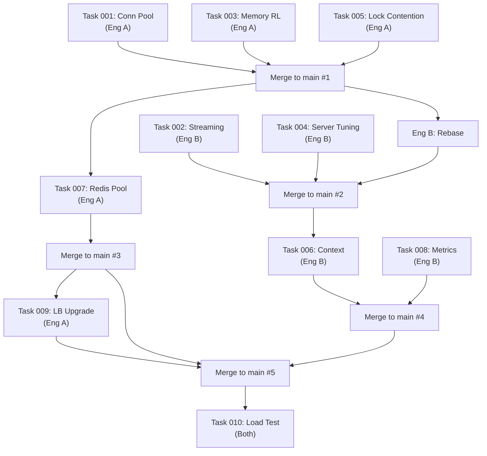

# Strategy Execution: GoProxy 10K RPS Improvement

**Date**: 2026-04-09  
**Team Size**: 2 Engineers (Engineer A, Engineer B)  
**Target**: Handle 10,000 Requests Per Second  
**Estimated Duration**: 5 working days (1 sprint week)

---

## Table of Contents

1. [Architecture Overview](#1-architecture-overview)
2. [Bottleneck Analysis](#2-bottleneck-analysis)
3. [Task Summary & Assignments](#3-task-summary--assignments)
4. [Parallel Execution Strategy](#4-parallel-execution-strategy)
5. [File Ownership Matrix](#5-file-ownership-matrix)
6. [Day-by-Day Execution Plan](#6-day-by-day-execution-plan)
7. [Merge Order & Conflict Prevention](#7-merge-order--conflict-prevention)
8. [Integration Checkpoints](#8-integration-checkpoints)
9. [Risk Mitigation](#9-risk-mitigation)
10. [Rollback Strategy](#10-rollback-strategy)

---

## 1. Architecture Overview

### Current Architecture (Before)

```
Client → [net/http server (default)] → [PanicRecovery middleware]
       → [Rate Limiter (Redis round-trip per request)]
       → [Circuit Breaker (mutex-locked)]
       → [Round-robin LB]
       → [HTTP Client (limited pool)] → Backend
       → [io.ReadAll (full body buffer)] → Client
```

### Target Architecture (After)

```
Client → [net/http server (tuned timeouts)] → [PanicRecovery middleware]
       → [Rate Limiter (in-memory, O(1))]
       → [Circuit Breaker (atomic/lock-free)]
       → [Weighted RR / Least-Conn LB]
       → [HTTP Client (optimized pool, per-backend timeout)]
       → [Stream response directly (32KB pooled buffer)] → Client
       ↕ [Prometheus latency/inflight/throughput metrics]
```

### Key Improvements Summary

| Component | Before | After | Impact |
|-----------|--------|-------|--------|
| Rate Limiter | Redis (0.5ms/check) | In-memory (0.001ms/check) | **500x faster** |
| Connection Pool | 10 idle/host | 200 idle/host, 500 max/host | **50x capacity** |
| Response Handling | Buffer entire body | Stream via 32KB pooled buffer | **~0 alloc/req** |
| Circuit Breaker | RWMutex + data races | Atomic ops + sync.Map | **Lock-free reads** |
| Server | No timeouts | Configurable timeouts | **Leak prevention** |
| Load Balancer | Round-robin only | Round-robin + Weighted RR + Least-Conn | **Capacity-aware** |
| Observability | 4 counters | Histograms + gauges + latency | **Full visibility** |

---

## 2. Bottleneck Analysis

The following bottlenecks were identified through code analysis, prioritized by severity:

### Critical (Blocks 10K RPS)

| # | Bottleneck | File | Impact |
|---|-----------|------|--------|
| 1 | **Redis round-trip for every rate limit check** | `repository/rate_limiter.go` | 40K Redis cmds/sec; network latency dominates |
| 2 | **Connection pool too small** (10 idle/host) | `usecase/proxy.go:73-74` | TCP handshake per request; port exhaustion |
| 3 | **Full response body buffering** (io.ReadAll) | `usecase/proxy.go:212` | 100MB/s allocation; GC pressure |
| 4 | **No server timeouts** | `cmd/main.go:97-100` | Slow clients leak goroutines |

### High (Degrades performance at 10K RPS)

| # | Bottleneck | File | Impact |
|---|-----------|------|--------|
| 5 | **Data race in RingBufferCounter** | `entity/circuit_breaker.go:69` | Undefined behavior under concurrency |
| 6 | **Mutex contention in CircuitBreakerManager** | `usecase/circuit_breaker.go:52-54` | RLock per request; cache-line bouncing |
| 7 | **No context propagation** | `usecase/proxy.go:192` | Zombie goroutines from disconnected clients |
| 8 | **No performance metrics** | `pkg/metrics/` | Can't identify bottlenecks during load test |

### Medium (Optimization)

| # | Bottleneck | File | Impact |
|---|-----------|------|--------|
| 9 | **Round-robin ignores capacity** | `entity/load_balancer.go` | Uneven load distribution |
| 10 | **No benchmarks** | none | Can't validate 10K RPS claim |

---

## 3. Task Summary & Assignments

### Engineer A (Infrastructure & Data Path)

| Task | Title | Priority | Effort | Files |
|------|-------|----------|--------|-------|
| 001 | Connection Pool Tuning | P0 | 2-3h | `proxy.go`, `config.go`, `config.json` |
| 003 | In-Memory Rate Limiter | P0 | 4-5h | NEW: `memory_rate_limiter.go`, `config.go`, `main.go` |
| 005 | Reduce Lock Contention | P1 | 3-4h | `entity/circuit_breaker.go`, `usecase/circuit_breaker.go` |
| 007 | Redis Pool Optimization | P1 | 2-3h | `main.go`, `config.go`, `config.json` |
| 009 | Load Balancer Upgrade | P2 | 3-4h | `entity/load_balancer.go`, `config.go`, `main.go` |

**Engineer A Focus**: Connection infrastructure, rate limiting, circuit breaker internals, load balancer algorithms.

### Engineer B (Request Path & Observability)

| Task | Title | Priority | Effort | Files |
|------|-------|----------|--------|-------|
| 002 | Response Streaming | P0 | 3-4h | `proxy.go`, `proxy_test.go` |
| 004 | Server Tuning | P0 | 2-3h | `main.go`, `config.go`, `config.json` |
| 006 | Context Propagation | P1 | 3-4h | `proxy.go`, `config.go`, `proxy_test.go` |
| 008 | Performance Metrics | P1 | 3-4h | `metrics.go`, `proxy.go`, `main.go` |

**Engineer B Focus**: Request/response path optimization, server configuration, observability.

### Joint Task

| Task | Title | Priority | Effort |
|------|-------|----------|--------|
| 010 | Load Testing & Benchmarks | P0 | 4-5h |

---

## 4. Parallel Execution Strategy

### Core Principle: File Ownership by Phase

To prevent merge conflicts, tasks are organized into **4 phases** where each engineer owns specific files. Within a phase, engineers **never touch the same file**.

```
Phase 1 (Day 1-2):  Independent work — zero file overlap
Phase 2 (Day 2-3):  Sequenced work — Engineer B waits for A on shared config
Phase 3 (Day 3-4):  Sequential on shared files — clear merge order defined
Phase 4 (Day 5):    Joint integration + load testing
```

### Branching Strategy

```
main
  ├── feat/improvement-02-engineer-a   (Tasks 001, 003, 005, 007, 009)
  ├── feat/improvement-02-engineer-b   (Tasks 002, 004, 006, 008)
  └── feat/improvement-02-loadtest     (Task 010 — branched from merged A+B)
```

**Rules**:
1. Each engineer works on their own branch
2. **Never rebase from the other engineer's branch** — only from `main`
3. Engineer A merges first (infrastructure changes), then Engineer B rebases and merges
4. Final load test branch is created after both are merged to `main`

---

## 5. File Ownership Matrix

This matrix shows which engineer owns which file in each phase. **Red cells = conflict zone**, resolved by merge order.

### Phase 1 (Day 1-2) — Zero Overlap

| File | Engineer A | Engineer B |
|------|-----------|-----------|
| `internal/usecase/proxy.go` | ✅ Task 001 (transport change in NewHTTPProxy) | ✅ Task 002 (add streaming methods) |
| `internal/repository/memory_rate_limiter.go` | ✅ Task 003 (NEW file) | — |
| `internal/entity/circuit_breaker.go` | — | — |
| `cmd/main.go` | — | — |
| `pkg/utils/config.go` | — | — |
| `pkg/metrics/metrics.go` | — | — |

> **⚠️ proxy.go conflict resolution**: Engineer A modifies only `NewHTTPProxy` function signature (lines 64-79). Engineer B adds new methods (`streamResponse`, `doStreamingRequest`) and modifies `ForwardRequest` body. These are **non-overlapping regions** of the same file. However, to be safe:
> - **Engineer A merges proxy.go changes first**
> - **Engineer B rebases before modifying ForwardRequest**

### Phase 2 (Day 2-3) — Sequenced

| File | Engineer A | Engineer B |
|------|-----------|-----------|
| `internal/entity/circuit_breaker.go` | ✅ Task 005 (atomics) | — |
| `internal/usecase/circuit_breaker.go` | ✅ Task 005 (sync.Map) | — |
| `cmd/main.go` | ✅ Task 003 (rate limiter selection) | ✅ Task 004 (server config) |
| `pkg/utils/config.go` | ✅ Task 003 (RateLimiterStorage field) | ✅ Task 004 (ServerConfig struct) |

> **⚠️ main.go + config.go conflict resolution**:
> - Engineer A adds `RateLimiterStorage` to config and rate limiter selection in main.go
> - Engineer B adds `ServerConfig` to config and server tuning in main.go
> - These are **different sections** of both files
> - **Merge order**: Engineer A merges first → Engineer B rebases and adds their sections

### Phase 3 (Day 3-4) — Sequential Shared Files

| File | Engineer A | Engineer B |
|------|-----------|-----------|
| `internal/usecase/proxy.go` | — | ✅ Task 006 (context propagation) |
| `cmd/main.go` | ✅ Task 007 (Redis pool) | ✅ Task 008 (metrics registration) |
| `pkg/utils/config.go` | ✅ Task 007 (RedisConfig extension) | ✅ Task 006 (backend timeout) |
| `pkg/metrics/metrics.go` | — | ✅ Task 008 (new metrics) |
| `internal/entity/load_balancer.go` | ✅ Task 009 (strategies) | — |

> **Merge order for Phase 3**: 
> 1. Engineer A merges Task 007 (Redis pool) - modifies `RedisConfig` struct and `main.go` Redis init
> 2. Engineer B merges Task 006 (context) - adds `BackendConfig.Timeout` (different struct) and `proxy.go` changes
> 3. Engineer B merges Task 008 (metrics) - adds new vars to `metrics.go` and registration in `main.go`
> 4. Engineer A merges Task 009 (load balancer) - only touches `entity/load_balancer.go` and `NewLoadBalancer` call in `main.go`

### Phase 4 (Day 5) — Joint

| File | Both Engineers |
|------|---------------|
| `internal/usecase/benchmark_test.go` | ✅ Task 010 (NEW file) |
| `scripts/loadtest.sh` | ✅ Task 010 (NEW file) |
| `config.json` | ✅ Final production config |

---

## 6. Day-by-Day Execution Plan

### Day 1 — Foundation (Parallel, Zero Conflict)

```
┌─────────────────────────────────────┐  ┌─────────────────────────────────────┐
│         ENGINEER A                   │  │         ENGINEER B                   │
│                                      │  │                                      │
│  09:00 Create branch                 │  │  09:00 Create branch                 │
│        feat/improvement-02-eng-a     │  │        feat/improvement-02-eng-b     │
│                                      │  │                                      │
│  09:30 Task 001: Connection Pool     │  │  09:30 Task 002: Response Streaming  │
│        - Add TransportConfig         │  │        - Add streamBufPool           │
│        - Modify NewHTTPProxy         │  │        - Add streamResponse()        │
│        - Update config.json          │  │        - Add doStreamingRequest()    │
│                                      │  │        - Rename doRequest →          │
│                                      │  │          doBufferedRequest           │
│                                      │  │                                      │
│  12:00 Commit + run tests            │  │  12:00 Commit + run tests            │
│        go test -race ./...           │  │        go test -race ./...           │
│                                      │  │                                      │
│  13:00 Task 003: In-Memory RL        │  │  13:00 Task 004: Server Tuning       │
│        - Create memory_rate_limiter  │  │        - Add ServerConfig            │
│        - Add RL storage config       │  │        - Set server timeouts         │
│        - Tests + concurrent test     │  │        - Use dedicated ServeMux      │
│                                      │  │                                      │
│  17:00 Commit + run tests            │  │  16:00 Commit + run tests            │
│        Push branch                   │  │        Push branch                   │
└─────────────────────────────────────┘  └─────────────────────────────────────┘
```

**End of Day 1 Checkpoint**: Both engineers run `go test -race ./...` on their branches independently. All tests pass.

---

### Day 2 — Core Optimizations (Parallel, Minor Config Overlap)

```
┌─────────────────────────────────────┐  ┌─────────────────────────────────────┐
│         ENGINEER A                   │  │         ENGINEER B                   │
│                                      │  │                                      │
│  09:00 Task 005: Lock Contention     │  │  09:00 ⏳ WAIT for A's proxy.go     │
│        - Fix RingBuffer data race    │  │        merge from Task 001           │
│        - Atomic SlidingWindow        │  │                                      │
│        - sync.Map for CB manager     │  │  09:30 Rebase on main (after A      │
│        - Atomic circuit breaker      │  │        merges Task 001)              │
│          state transitions           │  │                                      │
│                                      │  │  10:00 Task 006: Context Propagation │
│                                      │  │        - NewRequestWithContext       │
│                                      │  │        - Per-backend timeout map     │
│                                      │  │        - Timeout config in backend   │
│                                      │  │                                      │
│  13:00 Commit + run tests            │  │  13:00 Commit + run tests            │
│        go test -race ./...           │  │        go test -race ./...           │
│                                      │  │                                      │
│  14:00 🔀 MERGE Task 001+003+005     │  │  14:00 Task 008: Performance Metrics │
│        to main via PR                │  │        - Add 7 new Prometheus        │
│                                      │  │          metrics                     │
│  15:00 Task 007: Redis Pool          │  │        - Instrument ForwardRequest   │
│        - Extend RedisConfig          │  │        - Track latency, inflight,    │
│        - Pool params in main.go      │  │          response size               │
│        - Validation                  │  │                                      │
│                                      │  │                                      │
│  17:00 Commit + run tests            │  │  17:00 Commit + run tests            │
│        Push branch                   │  │        Push branch                   │
└─────────────────────────────────────┘  └─────────────────────────────────────┘
```

**Day 2 Critical Path**: Engineer A must merge Tasks 001+003+005 to `main` by 14:00 so Engineer B can rebase before working on Task 006/008 (which modify `proxy.go`).

---

### Day 3 — Advanced Features (Sequential Merge)

```
┌─────────────────────────────────────┐  ┌─────────────────────────────────────┐
│         ENGINEER A                   │  │         ENGINEER B                   │
│                                      │  │                                      │
│  09:00 Task 009: Load Balancer       │  │  09:00 🔀 MERGE Tasks 002+004+006   │
│        - Weighted round-robin        │  │        +008 to main via PR           │
│        - Least connections           │  │        (rebase on A's merged main)   │
│        - Strategy config             │  │                                      │
│        - LB tests                    │  │  10:00 Code review of A's merged    │
│                                      │  │        code (Tasks 001+003+005+007) │
│                                      │  │                                      │
│  13:00 Commit + run tests            │  │  13:00 Resolve any merge conflicts  │
│                                      │  │        from rebase                   │
│  14:00 🔀 MERGE Task 007+009         │  │                                      │
│        to main via PR                │  │  14:00 🔀 MERGE B's branch to main  │
│                                      │  │                                      │
│  15:00 Integration test: run full    │  │  15:00 Integration test: run full    │
│        test suite on merged main     │  │        test suite on merged main     │
│        go test -race ./...           │  │        go test -race ./...           │
│                                      │  │                                      │
│  16:00 Fix any integration issues    │  │  16:00 Fix any integration issues    │
└─────────────────────────────────────┘  └─────────────────────────────────────┘
```

**Day 3 Checkpoint**: All 9 tasks merged to `main`. Full test suite passes with `-race` flag.

---

### Day 4 — Integration & Config Finalization

```
┌───────────────────────────────────────────────────────────────────────────────┐
│                         BOTH ENGINEERS (Pair)                                 │
│                                                                               │
│  09:00 Create feat/improvement-02-loadtest from main                          │
│                                                                               │
│  09:30 Task 010, Part A: Write Go benchmark tests                             │
│        - Engineer A: BenchmarkRateLimiter, BenchmarkCircuitBreaker,           │
│                       BenchmarkLoadBalancer                                   │
│        - Engineer B: BenchmarkForwardRequest (both variants)                  │
│                                                                               │
│  12:00 Run benchmarks: go test -bench=. -benchmem ./internal/usecase/         │
│        Record baseline numbers                                                │
│                                                                               │
│  13:00 Task 010, Part B: Create load test script                              │
│        - Engineer A: Script + loadtest_config.json                            │
│        - Engineer B: Start proxy with loadtest config, run load test          │
│                                                                               │
│  15:00 Analyze results                                                        │
│        - Check p99 latency < 200ms                                            │
│        - Check error rate < 1%                                                │
│        - Check memory stability                                               │
│        - Profile if targets not met                                           │
│                                                                               │
│  16:00 Fix any performance issues found                                       │
│                                                                               │
│  17:00 Merge to main                                                          │
└───────────────────────────────────────────────────────────────────────────────┘
```

---

### Day 5 — Validation & Documentation

```
┌───────────────────────────────────────────────────────────────────────────────┐
│                         BOTH ENGINEERS (Pair)                                 │
│                                                                               │
│  09:00 Final validation run                                                   │
│        - go test -race -count=3 ./...                                         │
│        - go test -bench=. -benchmem -count=3 ./internal/usecase/              │
│        - ./scripts/loadtest.sh 10000 60   (60-second sustained test)          │
│                                                                               │
│  11:00 Document results                                                       │
│        - Benchmark numbers in docs/improvement-02/results.md                  │
│        - Before/After comparison table                                        │
│        - Prometheus dashboard screenshots (if applicable)                     │
│                                                                               │
│  13:00 Update config.json with production-ready defaults                      │
│        Update README.md with new configuration options                        │
│                                                                               │
│  15:00 Final PR review and merge                                              │
│        Tag release: v0.2.0-10k-rps                                            │
└───────────────────────────────────────────────────────────────────────────────┘
```

---

## 7. Merge Order & Conflict Prevention

### Strict Merge Sequence



### Conflict Prevention Rules

| Rule | Description |
|------|-------------|
| **R1: One owner per struct** | Only one engineer adds fields to a given struct in a given phase |
| **R2: New files = no conflict** | Prefer creating new files over modifying shared ones |
| **R3: Append-only config** | Config struct changes are always additive (new fields), never modifying existing ones |
| **R4: Function-level ownership** | In `proxy.go`, Engineer A owns `NewHTTPProxy`, Engineer B owns `ForwardRequest` body and new methods |
| **R5: Merge gate** | Don't start dependent work until prerequisite is merged to `main` |

### If Conflict Occurs

1. **Stop work immediately** — don't try to resolve alone
2. **Compare diffs** — `git diff main...feat/improvement-02-eng-a -- path/to/file`
3. **Both engineers on call** — resolve together in 15 minutes
4. **Prefer the later change** — earlier change is already in `main` and tested

---

## 8. Integration Checkpoints

### Checkpoint 1: End of Day 1

```bash
# Both engineers independently:
cd $PROJECT_ROOT
git checkout feat/improvement-02-eng-{a,b}
go test -race ./...
go build -o /dev/null ./cmd/
```

**Pass criteria**: All tests pass, build succeeds, no race conditions.

### Checkpoint 2: After Engineer A's First Merge (Day 2, 14:00)

```bash
git checkout main
go test -race ./...
# Verify new config fields have defaults
go run ./cmd/main.go &
curl http://localhost:8080/metrics  # Should show metrics endpoint
kill %1
```

**Pass criteria**: Server starts with new transport config, memory rate limiter is selected by default.

### Checkpoint 3: After All Merges (Day 3, 15:00)

```bash
git checkout main
go test -race -count=3 ./...
go build -o proxy ./cmd/
./proxy &
# Quick smoke test
for i in $(seq 1 100); do curl -s http://localhost:8080/ > /dev/null; done
curl http://localhost:8080/metrics | grep proxy_request_duration
kill %1
```

**Pass criteria**: 100 serial requests succeed, new latency metrics appear in `/metrics`.

### Checkpoint 4: After Load Test (Day 4, 15:00)

```bash
./scripts/loadtest.sh 10000 30
```

**Pass criteria**: 
- Sustained 10K RPS for 30 seconds
- Error rate < 1%
- p99 latency < 200ms
- Memory stable (no growth trend)

---

## 9. Risk Mitigation

| Risk | Probability | Impact | Mitigation |
|------|------------|--------|------------|
| Merge conflict in `proxy.go` | Medium | Low | Function-level ownership; A owns constructor, B owns methods |
| Merge conflict in `config.go` | Medium | Low | Each adds different struct; append-only changes |
| Merge conflict in `main.go` | Medium | Low | Each adds code in different sections; clear separation |
| In-memory rate limiter incorrect | Low | High | Comprehensive tests including concurrent test with `-race` |
| Streaming breaks singleflight | Low | High | Task 002 explicitly keeps buffering for singleflight path |
| Atomic circuit breaker regression | Low | Medium | Existing tests + new concurrent stress test |
| Load test doesn't reach 10K | Medium | Medium | Profile with pprof; iterative optimization on Day 4-5 |
| Redis unavailable in test env | Low | Low | Default to memory rate limiter; Redis is optional |

---

## 10. Rollback Strategy

### Per-Task Rollback

Each task is in a separate commit (or set of commits). To rollback a specific task:

```bash
# Find the merge commit for the task
git log --oneline --merges

# Revert specific merge
git revert -m 1 <merge-commit-hash>
```

### Full Rollback

If the entire improvement causes production issues:

```bash
# Revert to pre-improvement state
git revert --no-commit HEAD~N  # where N = number of merge commits
git commit -m "revert: rollback improvement-02 (10K RPS)"
```

### Feature Flags

The following improvements can be disabled via config without code changes:

| Feature | Config to Disable |
|---------|------------------|
| In-memory rate limiter | `"rate_limiter_storage": "redis"` |
| Server timeouts | Remove `"server"` section (uses Go defaults) |
| Connection pool tuning | Remove `"transport"` section (uses conservative defaults) |
| Load balancer strategy | `"load_balancer_strategy": "round_robin"` |
| Per-backend timeouts | Remove `"timeout"` from backend config |

---

## Appendix A: Communication Protocol

### Daily Sync (10 minutes max)

- **09:00 daily standup**: What I did yesterday, what I'm doing today, any blockers
- **Merge notification**: Slack/chat message when merging to `main` → other engineer rebases
- **Conflict flag**: Immediately notify if touching an unexpected file

### PR Review Rules

- **Self-merge for non-overlapping code**: If touching only files you own, self-merge after tests pass
- **Cross-review for shared files**: Changes to `config.go`, `main.go`, `proxy.go` require review from the other engineer
- **Benchmark results in PR description**: Include `go test -bench` output in the PR

---

## Appendix B: Environment Setup

Both engineers should configure:

```bash
# Verify Go version
go version  # Should be 1.24.12+

# Install load testing tool
go install github.com/rakyll/hey@latest

# Set GOMAXPROCS for consistent benchmarks
export GOMAXPROCS=4

# Recommended: run Redis locally for Task 007 testing
docker run -d --name redis-test -p 6379:6379 redis:7-alpine
```

---

## Appendix C: Success Definition

The improvement is considered **successful** when:

1. ✅ `go test -race ./...` — All tests pass with no race conditions
2. ✅ `go test -bench=. ./internal/usecase/` — All benchmarks exceed targets
3. ✅ `./scripts/loadtest.sh 10000 30` — Sustained 10K RPS for 30s, <1% errors, p99 <200ms
4. ✅ Memory usage stable under sustained load (no goroutine/memory leak)
5. ✅ All new configuration options have defaults (backward compatible)
6. ✅ Clean git history with logical, reviewable commits
